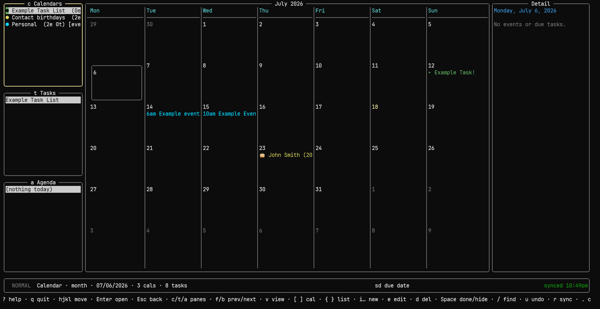
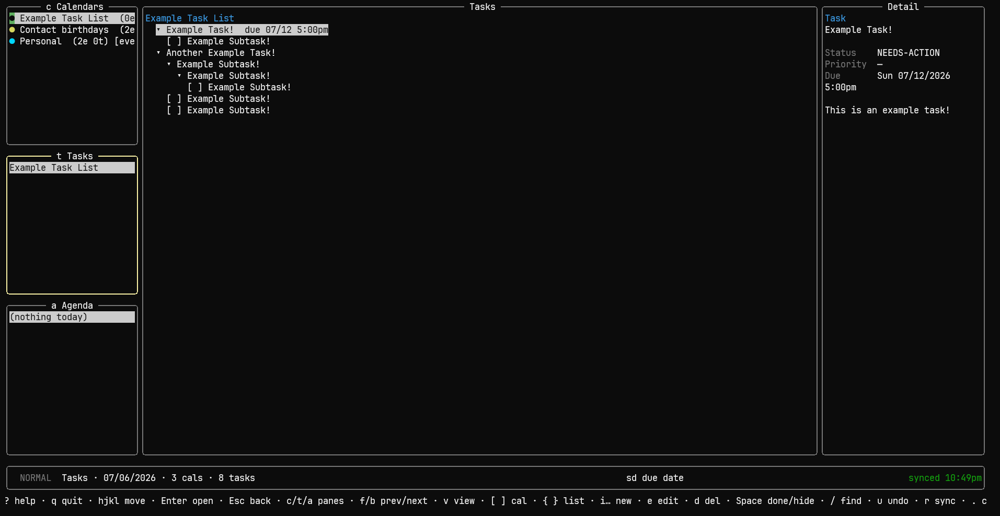

# LazyPlanner

A terminal-based todo-list and calendar manager with offline-first CalDAV sync — a full-screen interactive TUI in the style of [lazygit](https://github.com/jesseduffield/lazygit), written in Go.

<p align="center">
  
</p>

## What it does

- **Syncs with a CalDAV server** (built for NextCloud): offline-first, so the app opens instantly and works without network; changes sync both ways and stay visible from NextCloud web and your phone.
- **Todo management** with deep subtask hierarchies — arbitrary nesting, navigated like a file explorer.
- **Calendar views** — month, week, and day grids for events and dated tasks.
- **Recurring events and tasks**, including per-occurrence editing.
- Keyboard-first (single-key shortcuts + a `:` command mode), with full mouse support.

<p align="center">
  
  <br>
  <em>Deep subtask hierarchies, navigated like a file explorer.</em>
</p>

## Configuration

On first run (no config file), LazyPlanner writes a fully-commented `config.toml` to `~/.config/lazyplanner/` (Linux) / `%APPDATA%\lazyplanner\` (Windows) and exits so you can fill in the connection. You configure one or more **accounts** as `[[account]]` blocks; every other option is shown at its default, commented out. The app **reads this file once at startup and never writes it**.

```toml
[[account]]
name = "personal"                          # a unique label, shown in :account and the status bar
url = "https://cloud.example.com/remote.php/dav"
username = "you"
# password = "your-app-password"          # inline (keep the file chmod 600)
password_command = "bw get password lazyplanner"   # or fetch it from a command

[[account]]
name = "work"
url = "https://work.example.com/remote.php/dav"
username = "employee"
password_command = "bw get password lazyplanner-work"
```

Each account needs a unique `name`. **One account is active at a time**; switch between them in-app with `:account` (see [Usage](#usage)) — there is no merged multi-account view. A single-account config is just one `[[account]]` block.

> **Upgrading from a pre-1.1 config?** The old single `[server]` section was replaced by `[[account]]` blocks. Rename `[server]` to `[[account]]` and add a `name`; the connection fields are otherwise unchanged, and your existing cache is reused (its id still derives from the URL + username). LazyPlanner refuses to start with a leftover `[server]` section and tells you this.

Authentication is always a NextCloud **app password** (Settings → Security → Devices & sessions), never your account password. `password_command` (its stdout is used as the secret) keeps the password out of the file — e.g. `bw get password …` with Bitwarden/Vaultwarden. If the file is group/other-readable, LazyPlanner warns you to `chmod 600` it.

The `[appearance]` section tunes display (all optional): `first_day_of_week`, `default_view`, `time_format`, `date_format`, and **`color_mode`** — how calendar colors render. `color_mode` defaults to `auto` (exact 24-bit truecolor, which your terminal downsamples to 256 or 16 colors as needed); set it to `truecolor` to force 24-bit on a terminal that underreports, `16` to use the nearest themed ANSI color (inherits your terminal theme — good for a light terminal or bare console), or `off` for no calendar colors.

The local cache is **namespaced by account** (a stable id derived from the server URL + username), so each account keeps its own cache and two accounts' data never mix. Data lives under the OS data directory (`~/.local/share/lazyplanner/<account-id>/` on Linux); which account was active last is remembered in a small `global.json` at the data-dir root and reopened next launch.

## Usage

Run `lazyplanner` with no arguments to open the TUI (seed the cache with `import` first — see [Syncing](#syncing)). The screen has three regions: a left **overview** column (**Calendars**, **Tasks**, **Agenda**), a **center** pane that follows the focused panel, and a right **Detail** pane showing the highlighted item's fields. `c`/`t`/`a` focus a panel, `Enter` dives into the center, `Esc` backs out. Movement is vim-style — `hjkl`/arrows, a `count` prefix (`3j`), `gg`/`G` for top/bottom. The [keybindings table](#keybindings) is the full key reference; the notes below cover what a key list can't:

- **Calendars** → the center shows a month grid or a week/day hourly **time-grid** (`v` cycles). Each list row carries a **color dot** in the calendar's exact server color (matching NextCloud; auto-downsampled per `color_mode`, dropped when hidden) and a **`[events]`/`[tasks]`/`[both]`** tag — **`[?]`** until a sync confirms the type, **`[ro]`** for read-only. That color tints the calendar's items in every view. `Enter` **drills into a day**: navigation then becomes 2D over the day's layout — `↑`/`↓` by time, `←`/`→` between overlapping side-by-side events. Dated tasks show here too, as a `[ ]`/`[■]` line at the due time (all-day-due in the top band).
- **Tasks** → pick a list and its full **subtask tree** opens in the center with inline priority/due/status. `>` zooms into a subtree (`cd`-style, with a breadcrumb), `<` zooms back out; `z` folds it.
- **Agenda** → the day's events and due tasks at full width; moving the highlight outlines and auto-scrolls to the matching block in the center.

**Creating & editing.** Create actions live under the **`i` prefix** (a which-key hint pops up after `i`); the object letter picks the type — `t` task, `e` event, `s` subtask, `c` calendar, `l` list — and a **capital** `T`/`E`/`S` opens the full form instead of the one-line quick-add (calendars and lists always open their form).

- A subtask is created under the selected task, in its parent's own list; calendars/lists are created **offline-first** (they appear now, hit the server on the next sync) with a **Color** field and swatch picker so they're colored from the start.
- Quick-add parses smart tokens and leaves anything ambiguous in the title:
  - **date** — `today`, `fri`, `jul 20`, `7/20`, `2026-07-20`; relative `next fri`, `next week`/`next month`, `in 3 days`/`weeks`/`months`.
  - **time** — `3pm`, `3:30pm`, `15:00`, or a range `5-6pm` / `14:00-15:30` (an event gets the end; a task uses the start). A bare number is never a time.
  - **repeat** — `daily`/`weekly`/`monthly`/`yearly`, `every mon`, `every jul 20` (sets the date itself when you don't type one). For richer rules, use the full form's **Repeat** field.
  - **`!` priority** (`!high`/`!1`–`!9`), **`#tag`**, and **`@location`** (`@home` or `@"room 204"`).
  - An obvious typo (`!hgh`, `next tuedsay`, `25:00`) keeps the input open with a warning — submit the same text again to keep it as-is.
- Creation is **locked to the calendar's type** (events only on `[events]`/`[both]`, tasks only on `[tasks]`/`[both]`); an unconfirmed `[?]` calendar blocks creation until a sync settles it, unless you force it with **`i!`** (e.g. `i!e`) — read-only and known-wrong-type are never forced.
- `e` edits the selected item (or, with the Calendars/Tasks panel focused, that calendar/list's name + color); `s` quick-sets one field (`sp` priority, `sd` due); `d` deletes (an item after a confirm — a folder removes its whole subtree; a calendar/list, when its panel is focused, requires typing its name to confirm because it can't be undone).
- The full forms use the same **NORMAL/DRILL** model as the rest of the app: a form opens in NORMAL, where `j`/`k`/arrows step between fields and the Save/Cancel buttons and `Enter` acts on the highlighted one — drilling a text field to type, opening a dropdown, or toggling a checkbox. In DRILL the keys reach the field; `Enter` moves on to the next field and `Esc` steps back out to NORMAL (a second `Esc` cancels the form).

**Folders.** A task with unfinished subtasks is a **folder** — drawn with a `▸` caret instead of a checkbox in every view — and can't be completed until they are. It keeps its own due date, so it still appears on the calendar (adding a subtask to a dated task just swaps `[ ]` for `▸`). `Space` toggles a task done in **any** view; in a calendar with no task drilled, `Space` instead hides/shows the highlighted calendar.

**Moving & grabbing.** `H`/`L` outdent/indent (re-parent); `y`/`Y` cut/copy a task with its subtree and `p`/`P` paste (the clipboard persists for repeat pastes). `m` enters **grab mode** to move an item in time — an event by hour/day (`J`/`K` resize its end), a task's due date by day/week — with `Enter` to keep and `Esc` to revert. `u` undoes the last change this session.

**Recurring items.** The full form has a **Repeat** field — `None`, a preset built from the item's date (`Daily`, `Weekly on <weekday>`, `Monthly on day <n>`, `Yearly on <mon day>`), or **Custom…** for any rule the app understands (an "every N" interval, a weekly weekday set, monthly by day-of-month or by nth/last weekday, yearly, and a never/on-date/after-N-times end). A rule the app can't represent is shown as *Custom rule (kept)* and left untouched unless you change it; picking a rule on a plain item makes it recurring, and `None` clears it.

Editing (`e`), deleting (`d`), or grabbing (`m`) a recurring **event** opens a scope picker — **This occurrence** (writes a `RECURRENCE-ID` override / `EXDATE`), **This & future** (splits the series at that point, preserving a bounded count), or **All** (edits the master, incl. its rule). A recurring **task** shows as a single live instance at its current due; completing it (`Space`) advances it to the next occurrence (the way NextCloud rolls a repeating task forward) — the flash confirms it advanced rather than being checked off, and it's marked done only when the series runs out. Editing "this occurrence" of a task detaches that instance as a separate one-off task (after a confirmation) and advances the rest.

**Commands & layout.** `:` opens a command line — `:sync`, `:view month|week|day`, `:goto`, `:search`, `:config`, `:account`, `:conflicts`, `:calendar new|rename|color|hide|show`, `:help`, `:q` — and the status bar's middle echoes the last action (`gd` opens `:goto` prefilled).

- **`:account`** switches the active account: `:account <name>`, or bare `:account` to pick from a list. LazyPlanner flushes pending changes, then reopens on the chosen account's cache. When more than one account is configured the status bar shows the active one.
- **`:config`** opens `config.toml` in `$EDITOR` and reloads on exit: a `color_mode` or credential change applies live, while an `auto`↔`truecolor` switch needs a restart. Editing the active account's connection (or removing it) can't be hot-swapped — use `:account` or restart.
- `:calendar` edits are offline-first and sync **both ways** — a rename/recolor pushes via `PROPPATCH`, and a change made in NextCloud is pulled back without clobbering an unpushed local edit.
- The status bar's left shows a vim-style **mode badge** — `NORMAL`, `DRILL` (drilled into a day, or editing a form field), `GRAB` — so a context-sensitive key like `hjkl` is never a surprise; its right shows the sync state and live conflict count.
- `+`/`-` accordion-expand the center (or zoom the time-grid hour height in week/day view); `Ctrl-←`/`Ctrl-→` and `Ctrl-W` resize the panes, widths remembered across launches.
- **Mouse**: click to focus/select, double-click the tree/agenda to edit, wheel to scroll. `?` opens the full cheat sheet.

### Managing Calendars

You can create and delete calendars/task lists in-app (`ic` / `il` to create a calendar / list, `d` to delete the focused pane's collection — confirmed by typing the collection's name, since it can't be undone — all offline-first), so you never need the NextCloud web UI. These CLI subcommands do the same directly on the server (via CalDAV `MKCALENDAR` / `DELETE`); they take the same connection flags/env vars as the other subcommands (see [Syncing](#syncing)).

```sh
lazyplanner calendar list                          # show calendars + their server paths
lazyplanner calendar create --name "Projects"      # an event calendar
lazyplanner calendar create --name "Errands" --tasks   # a task list (VTODO)
lazyplanner calendar create --name "Home" --both --color "#3366cc"
lazyplanner calendar delete --path "/remote.php/dav/calendars/you/errands/"
```

After creating a calendar, run `lazyplanner import` to pull it into the local cache.

### Keybindings

| Key | Action |
|---|---|
| `c` `t` `a` | Focus the Calendars / Tasks / Agenda overview panel |
| `Tab` / `Shift-Tab` | Cycle those three |
| `↑` `↓` `←` `→` / `j` `k` `h` `l` | Move the highlight in the focused pane |
| `<count>` + motion | Repeat a motion — `3j`, `5k` |
| `gg` / `G` | Go to top / bottom of the list, tree, or calendar grid (`<count>G` → nth item of a list, the tree, or a drilled day) |
| `Enter` | Dive into the center; cycle a day's events; open a list / expand a task |
| `Esc` | Back out to the overview · cancel a form/dialog/chord |
| `i` … | Create prefix — `t`/`T` task, `e`/`E` event, `s`/`S` subtask, `c` calendar, `l` list (Shift = full form) |
| `e` | Edit selected (full form) |
| `s` … | Quick-set a task field — `p` priority, `d` due date (blank clears) |
| `d` | Delete selected item — or the calendar/list when its panel is focused (typing its name to confirm, since a collection delete can't be undone) |
| `Space` | Toggle the selected/drilled task done — or hide/show the highlighted calendar (Calendar view, no task drilled) |
| `/` · `n` / `N` | Search the current view · next / prev match |
| `H` / `L` | Outdent / indent task (re-parent) |
| `y` / `p` | Yank / paste a task — move it (and its subtree) to another parent or list |
| `z` … | Fold the tree — `zR` expand-all, `zM` collapse-all, `za` toggle |
| `u` | Undo last local change (this session) |
| `v` | Cycle calendar view: month → week → day |
| `[` / `]` | Cycle the highlighted calendar (any mode) |
| `{` / `}` | Cycle the highlighted task list (any mode) |
| `f` / `b` · `gt` | Forward / back one period · jump to today |
| `+` / `-` / `0` | Accordion collapse / restore · in week/day: zoom hour height, `0` = auto-fit |
| `Ctrl-←` / `Ctrl-→` · `Ctrl-W` | Narrow / widen the overview column · resize sub-mode (overview + Detail) |
| `r` | Sync now (= `:sync`) |
| `:` · `gd` · `?` | Command line · go to date · help |
| `.` | Show/hide completed tasks |
| `q` / `Ctrl-C` | Quit / back out (best-effort syncs pending changes on the way out) |

## Syncing

Once an `[[account]]` is set, LazyPlanner syncs **both ways** automatically:

- on **startup** (the UI opens instantly from cache and refreshes when the sync lands);
- **periodically** while open (`sync_interval_minutes`, default 15, `0` = off);
- a few seconds after any local edit (a **debounced** background push, so other devices see changes fast) — deferred while a create/edit form is open, so an automatic sync never discards what you're typing;
- on **quit** (a best-effort push of anything still pending — skipped instantly when offline or nothing's pending, and time-bounded so a slow network can't delay exit);
- and on demand with `r` (or the `sync` subcommand below).

Sync is ETag-based and **never silently overwrites**: it pushes local creates/edits/deletes, pulls remote changes, and when the same item changed on both sides keeps both versions and flags the conflict (resolve in-app with `:conflicts` — keep local / keep server). It's also **incremental** — a calendar whose server CTag is unchanged (with nothing local to push) is skipped without re-downloading, so a routine sync of an idle account is cheap, which matters on a Raspberry Pi or with large calendars.

**Read-only calendars** (like NextCloud's generated "Contact Birthdays" calendar, or read-only shares) are detected automatically and marked `[ro]` in the overview. LazyPlanner never writes to them — creating/editing/deleting there is blocked with a hint, and sync mirrors them one-way — exactly as the NextCloud web UI treats them.

```sh
lazyplanner sync      # two-way sync of the local cache against the server
lazyplanner import    # one-way pull only (server → local), e.g. for a first seed
lazyplanner version   # print the version
lazyplanner help      # list the subcommands
```

(An unrecognized subcommand is reported with a non-zero exit and the usage, rather than silently opening the TUI.)

Both take the same connection flags as below (or the `LAZYPLANNER_CALDAV_URL` / `LAZYPLANNER_CALDAV_USERNAME` / `LAZYPLANNER_CALDAV_PASSWORD` environment variables), and honor `--data` to override the data directory:

```sh
lazyplanner sync \
  --url https://cloud.example.com/remote.php/dav \
  --username you \
  --password <app-password>
```

## Build and Install

**Pre-built binaries** for Linux, Raspberry Pi (ARM), Windows, and macOS are attached to every [GitHub Release](https://github.com/littekge/LazyPlanner/releases), named `lazyplanner_<os>_<arch>` alongside a `sha256sums.txt`. Download the one for your platform, make it executable, and put it on your `PATH` — no build step needed.

To build from source instead, requires [Go](https://go.dev/dl/) (see the `go` directive in `go.mod` for the minimum version). Dependencies are vendored, so no network is needed to build.

On first launch LazyPlanner writes a starter `config.toml` (see [Configuration](#configuration) above) and exits; fill in an `[[account]]` and run it again to open the TUI. Press `q` or `Ctrl-C` to quit.

A `Makefile` wraps the common tasks: `make build` (native binary), `make run`, `make cross` (the Raspberry Pi ARM binaries — see [Raspberry Pi](#raspberry-pi)), and `make release` (every distributable target into `dist/` with checksums — what CI attaches to a Release). Single targets are available too — `make build-linux-amd64`, `make build-windows-amd64`, `make build-darwin-arm64`, and so on. All of these **stamp the version** from the current git tag (so `lazyplanner version` reports e.g. `v1.0.0`); a plain `go build` leaves it as `dev`.

### Linux

The primary target: `go build -o lazyplanner ./cmd/lazyplanner` — a single static binary, no runtime dependencies. Run `./lazyplanner`.

### Windows

The secondary target, cross-compiled from any machine: `GOOS=windows go build -o lazyplanner.exe ./cmd/lazyplanner`.

### Raspberry Pi

LazyPlanner is a single static binary with no runtime dependencies, so it's a natural fit for a low-power Raspberry Pi used as an always-on wall calendar. Because it's pure Go (no cgo), you **cross-compile from any machine** — no ARM toolchain needed:

```sh
make cross      # → dist/lazyplanner_linux_{arm64,armv7,armv6}, stripped (~8.6 MB)
```

Pick the binary for your Pi and OS: **arm64** for 64-bit Raspberry Pi OS (Pi 3/4/5, Zero 2 W), **armv7** for 32-bit Pi OS (Pi 2/3/4, Zero 2 W), **armv6** for the original Pi / Pi Zero / Zero W. Copy it over and drop it on the `PATH`:

```sh
scp dist/lazyplanner_linux_arm64 pi@raspberrypi:/tmp/lazyplanner
ssh pi@raspberrypi 'sudo install -m0755 /tmp/lazyplanner /usr/local/bin/lazyplanner'
```

Run `lazyplanner` once to write the starter config, fill in an `[[account]]` (see [Configuration](#configuration)), and set `sync_interval_minutes` to how often the display should refresh from the server.

**Kiosk (launch full-screen on boot).** LazyPlanner is a terminal program, so the simplest dedicated-terminal setup is a console **autologin** on `tty1` that execs it — no X server needed. Enable console autologin with `sudo raspi-config` (*System Options → Boot / Auto Login → Console Autologin*), then have the login shell launch LazyPlanner on the main console only:

```sh
# ~/.bash_profile on the Pi — replace the login shell on tty1 with LazyPlanner,
# and drop back to a shell when you quit (q). Other ttys/SSH stay normal shells.
if [ "$(tty)" = "/dev/tty1" ]; then
  exec lazyplanner
fi
```

`raspi-config`'s autologin drops in a systemd getty override equivalent to:

```ini
# /etc/systemd/system/getty@tty1.service.d/autologin.conf
[Service]
ExecStart=
ExecStart=-/sbin/agetty --autologin pi --noclear %I $TERM
```

Set `color_mode = "16"` in the config if the Pi console is a bare framebuffer TTY (no truecolor); on a desktop terminal emulator leave it `auto`. The periodic background sync keeps the display current without any interaction.

**Performance.** The binary starts from the local cache instantly and syncs in the background, and the incremental CTag short-circuit keeps routine syncs cheap — both designed for modest hardware. The core hot paths (bulk import, tree building, recurrence expansion) scale **linearly** with calendar/list size, so large calendars stay responsive. Measure `time lazyplanner sync` and startup on your Pi and tune `sync_interval_minutes` to taste.

## Development

The project's full specification and development history live in [`main.md`](main.md) (the master spec, including the versioned build plan), [`log.md`](log.md) (the change log), and [`docs/audit/`](docs/audit/) (hardening-audit records); contributor/agent rules are in [`CLAUDE.md`](CLAUDE.md).

## License

[MIT](LICENSE)
